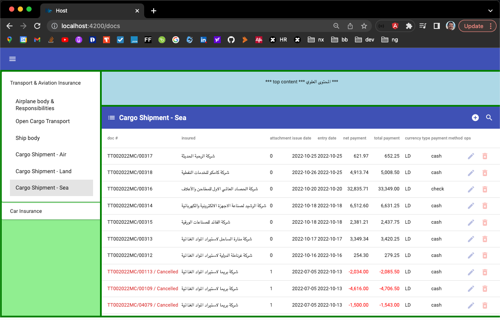
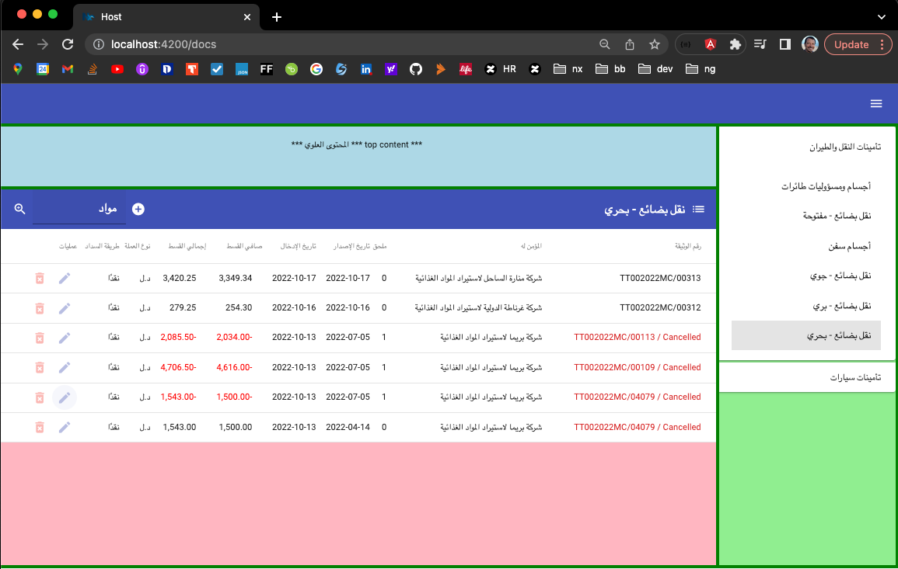

# tibesty

This project implements a monorepo app using module federation, micro frontends and remote apps to highlight the power of these concepts together into one project.
The project uses Angular 14, Angular Material and a NestJS server.

## Building
By running `npm i` at the root folder, a `node_modules` folder which contains all the source packages needed by the project is generated.

## Running
In the package.json file, you should find two targets, run then in sequence:
1. `npm run start:api` to start the NestJs server
2. `npm run start:docs` to run the entire set of remote apps, but with `docs` in dev mode

## Switching between Arabic and English
In `apps/host/src/index.html`, by simply toggling the value of the `dir` attribute between `ltr` and `rtl`, you should see the entire app displayed in English or in Arabic, respectively.

Here are a couple of images with some mock data when the app is running.

In English:

In Arabic:

